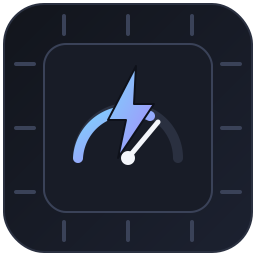

<p align="center">
  
</p>

<h1 align="center">dgx_spark_benchy</h1>
<p align="center"><i>by the Nokast community</i></p>

<p align="center">
  A benchmark for local LLMs on a single NVIDIA DGX Spark — not "what's the tokens/sec number,"
  but <b>which model should I actually run</b>: how much can it handle, how fast is it under
  real load, how many people can share it, and does it work at all for an agent that uses tools?
</p>

<p align="center">
  <a href="#"></a>
  <a href="#"></a>
  <a href="#"></a>
  <a href="#"></a>
</p>

---

## What this is, in plain terms

If you own a DGX Spark and are trying to pick a model to run on it — for coding help, a personal
agent, or just chat — the usual benchmark numbers don't answer the questions that actually matter
day to day:

- How big a document can I actually hand it before it breaks?
- How fast does it feel once it's talking?
- If two or three people (or agent sessions) use it at once, does it fall over?
- Can it reliably call tools/functions, or does it just talk about calling them?

This project answers those by actually running each model on a real DGX Spark, sending it real
requests under real load, and reporting what happened — not vendor marketing numbers, not a
single-request benchmark that ignores what happens under concurrency.

**Scope:** this is a single-machine benchmark. Everything here runs on one DGX Spark box (128GB
unified memory, one GB10 chip). If you're clustering multiple Sparks together, there's one
optional command for that (`interconnect`) and it's the only piece that doesn't apply otherwise.

👉 **[results/LEADERBOARD.html](results/LEADERBOARD.html)** — the actual numbers, one row per
model, plain-language columns.
👉 **[results/MODEL_WIKI.md](results/MODEL_WIKI.md)** — which models are worth trying, whether
NVIDIA/Hugging Face/Unsloth specifically recommend them for this hardware, and what's queued to
test next.
👉 **[METHODOLOGY.md](METHODOLOGY.md)** — exactly how every number is measured, with real example
commands and output.

## What's in the box

| Command | What it measures |
|---|---|
| `speed` | Raw inference speed: how long before the first word, how fast the words come after that, and how that changes as you feed it a longer document. Also probes the largest context it can actually handle. |
| `checks` | Quick sanity checks: does it write code that actually runs, does it call tools correctly, can it find a fact buried in a long document. |
| `eval` | A 22-task graded exam across 10 skill areas (tool use, following instructions, safety, robustness to bad input, multi-step planning, and more), each repeated multiple times so a lucky guess doesn't look like real skill. |
| `capacity` | **How many people can use it at once** — sends increasing numbers of simultaneous conversations until answers get measurably worse or slower, and reports the real ceiling, per workload shape (tool-chain agent, coding, casual chat). |
| `hermes` | A composite **Hermes Score** for running it behind a personal-agent harness specifically: does it complete real agent tasks (tools, web search, remembering things across a conversation), how many sessions can it sustain, and how fast does it start responding — all rolled into one 0-100 number. |
| `interconnect` | Bandwidth between Spark nodes over RoCE — only relevant for multi-node clusters, skips cleanly otherwise. |

*(`speed`/`checks`/`interconnect` used to be called `tier2`/`tier3`/`tier1` — those names still
work as aliases if you have scripts using them, but the commands themselves are unchanged.)*

Every run writes to one long-format CSV (`results/spark_bench_plus.csv`) plus a per-run Markdown
report, so results stay comparable over time — and `leaderboard.py` folds everything into the
one-row-per-model view above.

See **[METHODOLOGY.md](METHODOLOGY.md)** for exactly what each command sends and measures, with
real example output.

## Quickstart

```bash
git clone https://github.com/abhishek085/dgx_spark_benchy.git
cd dgx_spark_benchy
# stdlib only — no pip install needed, just Python 3.10+

# point at any OpenAI-compatible endpoint already serving a model
./spark_bench_plus.py speed --label my-model \
  --model your-model --endpoint http://localhost:8000/v1 \
  --contexts 4096,32768 --concurrency 1,4,16

./spark_bench_plus.py eval --label my-model \
  --model your-model --endpoint http://localhost:8000/v1 --repeats 3

./spark_bench_plus.py capacity --label my-model \
  --model your-model --endpoint http://localhost:8000/v1 \
  --skip-restart --profiles orchestrator,coding_agent,chat_agent \
  --concurrency 1,2,4,8,16,32

./leaderboard.py --write   # -> results/LEADERBOARD.md + results/LEADERBOARD.html
./model_wiki.py --write    # -> results/MODEL_WIKI.md
```

Any OpenAI-compatible `/v1/chat/completions` endpoint works — vLLM, llama.cpp, SGLang,
OpenRouter. `--skip-restart` on `capacity` assumes your server is already running; omit it and
pass `--vllm-cmd` if you want that command to manage vLLM restarts across GPU-utilization levels
itself (locally or over SSH via `--ssh-host`).

## Fast screening for a new candidate model

If you're trying a lot of quants (NVFP4, AWQ, unsloth releases, your own fine-tunes) and just
want a quick read before committing to a full multi-repeat eval:

```bash
./quickbench.sh <label> <model> <endpoint> [gpu_util]

# e.g.
./quickbench.sh qwen3-nvfp4-v2 unsloth/Qwen3-32B-NVFP4 http://localhost:8001/v1 0.85
```

This runs `checks` (sanity), a 1-repeat `eval` (all 10 domains), and a single-`gpu_util`
`capacity` pass against `orchestrator`/`coding_agent`/`chat_agent`, then rebuilds
`results/LEADERBOARD.md`. The candidate's own server needs to already be serving at `--endpoint`
— quickbench doesn't start vLLM for you, since serving flags vary too much across quant formats
to assume one invocation fits every candidate. If you're running another resident model on the
same box that needs its memory freed up first, stop/start that yourself around the call — that's
outside quickbench's scope on purpose, since it depends entirely on your own setup.

## Workload profiles — built for any harness, not just one

`agent_profiles.py` ships profiles covering the common shapes of agent traffic — multi-step
tool-chain planning (`orchestrator`), code generation graded by actually executing the output
(`coding_agent`), casual multi-turn chat (`chat_agent`), and the broader personal-agent shape
behind the Hermes Benchmark (`hermes`: tool chains including web search/file reads, long-context
recall inside a multi-turn session, remembering stated preferences across turns).

Don't want to touch Python? Point `--profiles-file` at a JSON file with your own harness's real
prompts instead — see `profiles/example_custom_profile.json`. Supported graders: `keyword`,
`tool_sequence`, `json_valid`, `code_exec` (executes the reply's code and checks the result
against test cases). Benchmarking against your **actual** prompts will always be more
representative than the generic profiles — copy one and edit it to match your real traffic if you
can.

`generate_data.py` can also use a large model to generate a bigger, more varied task pool than the
handful of hand-written examples each profile ships with — useful once you're pushing
concurrency high enough that repeating a few prompts would flatter prefix-caching more than real
varied traffic would. See `METHODOLOGY.md` and the script's own `--help` for details.

## Repository structure

```
dgx_spark_benchy/
├── spark_bench_plus.py    # CLI entrypoint — speed/checks/eval/capacity/hermes/interconnect
├── eval_scenarios.py       # 22 graded scenarios across 10 domains
├── agent_profiles.py       # orchestrator/coding_agent/chat_agent/hermes workload profiles
├── generate_data.py        # generator-model -> larger diverse task pool JSON for any profile
├── leaderboard.py          # builds results/LEADERBOARD.md + .html from accumulated CSV results
├── model_wiki.py           # builds results/MODEL_WIKI.md — GB10 fit + recommendations + roadmap
├── quickbench.sh           # fast checks+eval+capacity screening pass for a new model candidate
├── METHODOLOGY.md          # how every number on the leaderboard is actually measured
├── profiles/
│   └── example_custom_profile.json
├── assets/
│   └── logo.svg
└── results/                 # CSV + per-run markdown + saved visual artifacts (gitignored)
    ├── runs/
    └── artifacts/
```

## Design principles

- **stdlib only.** No dependency hell on a Spark box you're also using for training runs.
- **Partial credit, not pass/fail.** A model hitting 2 of 3 required tool calls scores 0.66, not 0.
- **Trial statistics matter.** Every eval scenario runs `--repeats` times; Pass@1 vs Pass@K exposes flakiness a single run hides.
- **Real load, not single-request numbers.** Capacity and Hermes Score both come from sending
  actual concurrent traffic, not extrapolating from one request.
- **Long-format CSV.** Every run appends comparable rows — build your own view of the data however you like.

## Roadmap / what's not measured yet

- **Context-handling and memory-management comparison.** `speed`'s context probe reports the
  *largest* context a model handled, but not *how* different architectures manage that memory —
  KV-cache quantization, prefix-cache reuse across conversation turns, Mamba/hybrid-attention
  models that scale near-linearly with context versus full-attention models that don't. That
  matters specifically for a multi-turn agentic harness like Hermes, where the same growing
  conversation gets re-processed turn after turn. Planned, not built yet.
- A golden-gate grader self-check, an endpoint preflight probe, and degenerate-score quarantine
  flags — production-hygiene gates that matter more for a public multi-model leaderboard than for
  benchmarking your own box, but a reasonable place to contribute if you want to extend this.

## Contributing

Scenarios, workload profiles, and graders are all just data — adding one is adding a dict to a
list. PRs adding realistic profiles for other popular harnesses, or closing the gaps above, are
welcome.

## License

MIT — see [LICENSE](LICENSE).

## Acknowledgments

Built as an extension of [spark-bench](https://github.com/Weschera/spark-bench) by Weschera —
the original raw-inference-speed and graded-scenario benchmark design for DGX Spark, and the
partial-credit/trial-statistics grading philosophy, originate there. This project adds the
capacity/concurrency dimension, the Hermes Benchmark, and the model wiki on top of that
foundation.
